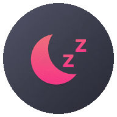

<!-- PROJECT LOGO -->
 

  

  <h3 align="center">Eversleep</h3>

  

    Everyman sleep calculator
     
     
    <a href="https://eversleep.timobechtel.com/">Live Website</a>
    ·
    <a href="https://github.com/TimoBechtel/eversleep/issues">Report Bug</a>
    ·
    <a href="https://github.com/TimoBechtel/eversleep/issues">Request Feature</a>
  

## About The Project

This project was created as part of the [111-Challenge](https://timobechtel.com/111-challenge/eversleep-polyphasic-scheduler/).

## Contributing

1. Fork the Project
2. Create your Feature Branch (`git checkout -b feature/AmazingFeature`)
3. Commit your Changes (`git commit -m 'feat: Add some AmazingFeature'`)
4. Push to the Branch (`git push origin feature/AmazingFeature`)
5. Open a Pull Request

### Commit messages

This project uses semantic-release for automated release versions. So commits in this project follow the [Conventional Commits](https://www.conventionalcommits.org/en/v1.0.0-beta.2/) guidelines. I recommend using [commitizen](https://github.com/commitizen/cz-cli) for automated commit messages.

## License

Distributed under the MIT License. See [LICENSE](https://github.com/TimoBechtel/settings-ui/blob/main/LICENSE) for more information.

## Contact

Timo Bechtel - [@TimoBechtel](https://twitter.com/TimoBechtel)

Project Link: [https://github.com/TimoBechtel/eversleep](https://github.com/TimoBechtel/eversleep)
